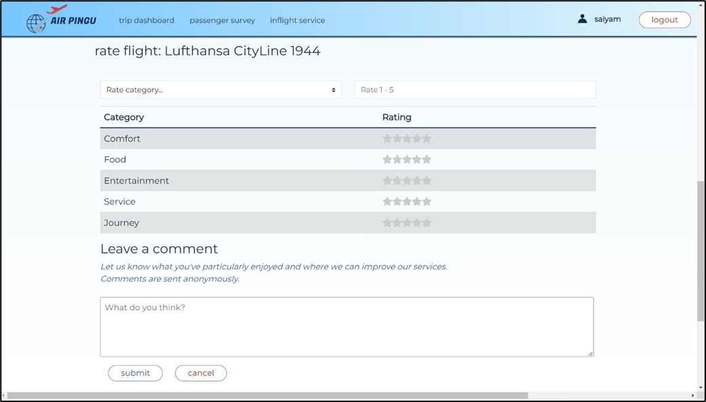

<!-- Template inspired from: Copyright (c) 2021 Othneil Drew -->

[![Contributors][contributors-shield]][contributors-url]
[![Forks][forks-shield]][forks-url]<!-- [![Issues][issues-shield]][issues-url] -->
[![MIT License][license-shield]][license-url]

<br />


## About The Project
This system is implemented using the traditional client server layered architecture based on the REST protocol, while leveraging various features of modern web applications. The server side is built on the Spring Boot framework for Java, which allows the handling of simple API calls and persistent storage through an inbuilt database feature. The client side is composed of HTML/CSS/JavaScript to be run in a browser, with the aid of React.js library.

### Use-case model:


### UML model: 


### Communication diagram:


### Component diagram: 


### Built With

* [![React][React.js]][React-url]
* [![Bootstrap][Bootstrap.com]][Bootstrap-url]
* [![Java][Java]][Java-url]
* 
<!-- GETTING STARTED -->
## Getting Started

### Prerequisites for starting up the system
* Linux:
  1. ```sh
     $ sudo apt install nodejs npm
     ```
  2. navigate to "Flight-Application"
  3. ```sh
     $ ./start_project.sh
     ```
* MacOs:
  1. ```sh
     $ brew install node
     ```
  2. navigate to "Flight-Application"
  3. ```sh
     $ ./start_project.sh
     ```
* Windows:
  1. download Node.js installer and install npm from browser
  2. navigate to "Flight-Application"
  3. ```sh
     $ ./start_project.bat
     ```

### Starting server
1. navigate to "Flight-Application"
2. ```shell
     $ ./gradlew clean build
     $ ./gradlew bootRun
     ```

### Starting client
  1. navigate to "Flight-Application/src/client"
  2. ```sh
     $ npm install --force --silent
     $ npm start --silent
     ```
     
## Usage





## Contributing
Contributions are always **greatly appreciated**!

If you have a suggestion that would make this better, please fork the repo and create a pull request. You can also simply open an issue

1. Fork the Project
2. Create your Feature Branch (`git checkout -b feature_name`)
3. Commit your Changes (`git commit -m commit_name`)
4. Push to the Branch (`git push origin feature_name`)
5. Open a Pull Request

Don't forget to give the project a star! Thanks again😊
## License

Distributed under the MIT License. See `LICENSE.md` for more information.


<!-- LINKS & IMAGES -->
[contributors-shield]: https://img.shields.io/github/contributors/Akshat125/Flight-Application.svg?style=for-the-badge
[contributors-url]: https://github.com/Akshat125/Flight-Application/graphs/contributors
[forks-shield]: https://img.shields.io/github/forks/Akshat125/Flight-Application.svg?style=for-the-badge
[forks-url]: https://github.com/Akshat125/Flight-Application/network/members
[stars-shield]: https://img.shields.io/github/stars/Akshat125/Flight-Application.svg?style=for-the-badge
[stars-url]: https://github.com/Akshat125/Flight-Application/stargazers
[issues-shield]: https://img.shields.io/github/issues/Akshat125/Flight-Application.svg?style=for-the-badge
[issues-url]: https://github.com/Akshat125/Flight-Application/issues
[license-shield]: https://img.shields.io/github/license/Akshat125/Flight-Application.svg?style=for-the-badge
[license-url]: https://github.com/Akshat125/Flight-Application/blob/master/LICENSE.txt
[linkedin-shield]: https://img.shields.io/badge/-LinkedIn-black.svg?style=for-the-badge&logo=linkedin&colorB=555
[linkedin-url]: https://linkedin.com/in/linkedin_username
[React.js]: https://img.shields.io/badge/React-20232A?style=for-the-badge&logo=react&logoColor=61DAFB
[React-url]: https://reactjs.org/
[Bootstrap.com]: https://img.shields.io/badge/Bootstrap-563D7C?style=for-the-badge&logo=bootstrap&logoColor=white
[Bootstrap-url]: https://getbootstrap.com
[Java]: https://img.shields.io/badge/Java-fff?style=for-the-badge&logo=Java&logoColor=007396
[Java-url]: https://www.java.com/en/
